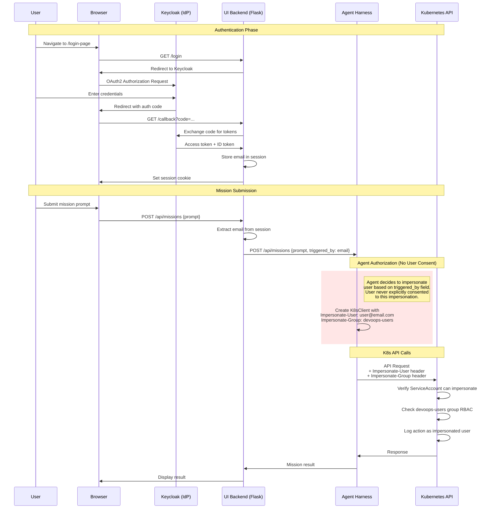

# Authorization Flow

This document describes how authorization works in the devoops agent system, highlighting the trust relationships and responsibilities.

## Sequence Diagram



## Key Security Considerations

### Trust Relationships

1. **UI Backend trusts Keycloak** - Session email comes from validated OAuth2 tokens
2. **Agent trusts UI Backend** - The `triggered_by` field is accepted without verification
3. **K8s trusts Agent ServiceAccount** - Impersonation is allowed based on RBAC

### Agent Harness Responsibilities

The agent harness bears significant responsibility:

- **Correct impersonation**: Must accurately pass the user's identity to K8s
- **No privilege escalation**: Can only impersonate the `devoops-users` group (enforced by RBAC `resourceNames`)
- **Audit integrity**: The audit trail depends entirely on the agent sending correct headers

### No Explicit User Consent

Users authenticate with Keycloak but never explicitly authorize the agent to:
- Act on their behalf in Kubernetes
- Use their identity for impersonation
- Perform operations under their name

This is an implicit trust model where using the devoops UI implies consent for the agent to act as you.

### RBAC Constraints

```yaml
# Agent can impersonate any user (for audit)
- resources: [users]
  verbs: [impersonate]

# Agent can ONLY impersonate devoops-users group (limits permissions)
- resources: [groups]
  resourceNames: [devoops-users]
  verbs: [impersonate]
```

The `resourceNames` constraint is critical - it prevents the agent from impersonating privileged groups like `system:masters`.

## Potential Threat Vectors

1. **Compromised Agent**: Could impersonate any user with `devoops-users` permissions
2. **UI Backend Vulnerability**: Could allow injection of arbitrary `triggered_by` values
3. **Session Hijacking**: Attacker could submit missions as another user
4. **Audit Log Manipulation**: Agent controls what identity appears in K8s audit logs
